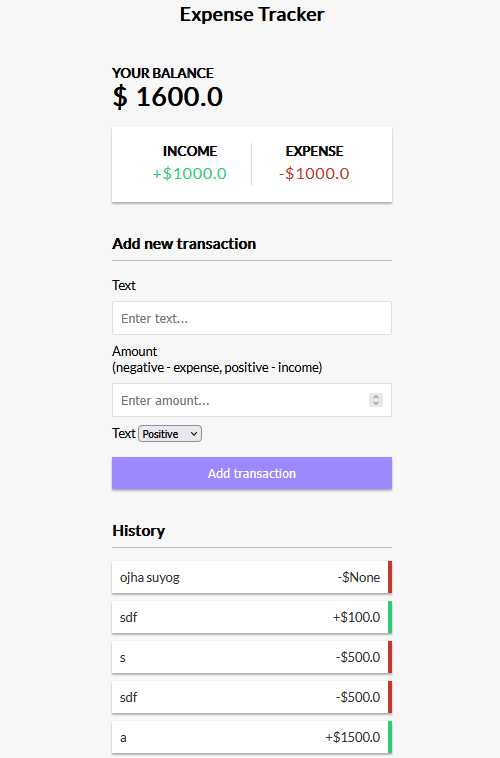

# 💰 Python Expense Tracker

[English](#english) | [Español](#español)

---

## English

# 💰 Python Expense Tracker



A web application developed with Django to track and manage personal expenses easily and efficiently.

## 📋 Description

**Expense Tracker** is a personal financial management tool that allows you to record, categorize, and analyze your daily expenses. The application provides an intuitive interface to keep detailed control of your personal finances.

## ✨ Features

- 📝 **Expense recording**: Add expenses with amount, category, date, and description
- 👤 **User profiles**: Each user has their own profile with personalized balance
- 📊 **Balance tracking**: View your current balance in real-time
- 🏷️ **Categorization**: Organize your expenses by categories
- 🔐 **Authentication system**: Secure registration and login
- 📱 **Responsive interface**: Adaptive design for different devices

## 🛠️ Technologies

- **Backend**: Django 4.2.11
- **Database**: SQLite3
- **Frontend**: HTML, CSS (Django templates)
- **Python**: 3.10 / 3.12

## 📁 Project Structure

```
Python-Expense-tracker-master/
│
├── home/                      # Main app
│   ├── migrations/            # Database migrations
│   ├── templates/             # HTML templates
│   │   ├── base.html         # Base template
│   │   └── home.html         # Home page
│   ├── admin.py              # Admin configuration
│   ├── models.py             # Models (Profile, Expense)
│   ├── views.py              # Views
│   ├── urls.py               # App URLs
│   └── tests.py              # Unit tests
│
├── project/                   # Project configuration
│   ├── settings.py           # Django settings
│   ├── urls.py               # Main URLs
│   └── wsgi.py               # WSGI config
│
├── static/                    # Static files (CSS, JS, images)
├── db.sqlite3                # SQLite database
├── manage.py                 # Django management script
└── requirements.txt          # Project dependencies
```

## 🚀 Installation and Setup

### Prerequisites

- Python 3.10 or higher
- pip (Python package manager)
- Anaconda (optional, but recommended)

### Step 1: Clone or download the repository

```bash
git clone https://github.com/OpSigma80/expense-tracker.git
cd expense-tracker
```

### Step 2: Create virtual environment (with Anaconda)

```bash
conda create -n ExpenseTracker python=3.10
conda activate ExpenseTracker
```

Or with venv:

```bash
python -m venv venv
venv\Scripts\activate  # Windows
source venv/bin/activate  # Linux/Mac
```

### Step 3: Install dependencies

```bash
pip install -r requirements.txt
```

### Step 4: Configure environment variables

Create a `.env` file in the root directory based on `.env.example`:

```bash
cp .env.example .env
```

Edit `.env` and add your SECRET_KEY:

```
SECRET_KEY=your-secret-key-here
DEBUG=True
```

### Step 5: Apply migrations

```bash
python manage.py migrate
```

### Step 6: Create superuser (admin)

```bash
python manage.py createsuperuser
```

Follow the instructions to create your administrator account.

### Step 7: Run the server

```bash
python manage.py runserver
```

The application will be available at: `http://127.0.0.1:8000/`

## 🎮 Usage

### Application access

1. **Home page**: `http://127.0.0.1:8000/`
2. **Admin panel**: `http://127.0.0.1:8000/admin/`

### Main features

1. **Record an expense**:
   - Enter the amount
   - Select or create a category
   - Add a description
   - Save the record

2. **View your balance**:
   - Balance updates automatically
   - View your total expenses

3. **Manage expenses**:
   - Edit existing expenses
   - Delete records
   - Filter by date or category

## 🧪 Testing

Run all tests:

```bash
python manage.py test
```

Run tests with coverage:

```bash
pip install coverage
coverage run --source='.' manage.py test
coverage report
coverage html  # Generate HTML report
```

Expected results:
```
Found 6 test(s).
Creating test database for alias 'default'...
......
Ran 6 tests in 7.842s
OK
```

## 📊 Data Models

### Profile (User Profile)
- `user`: Django User (OneToOne)
- `balance`: User's current balance
- `expense`: Accumulated total expenses

### Expense
- `user`: User who recorded the expense
- `amount`: Expense amount
- `category`: Expense category
- `description`: Optional description
- `date`: Expense date

## 🔧 Useful Commands

### Project management

```bash
# Create new migrations
python manage.py makemigrations

# Apply migrations
python manage.py migrate

# Create superuser
python manage.py createsuperuser

# Run development server
python manage.py runserver

# Run server on specific port
python manage.py runserver 8080

# Run Django shell
python manage.py shell

# Collect static files
python manage.py collectstatic
```

### Testing

```bash
# Run all tests
python manage.py test

# Run tests for specific app
python manage.py test home

# Run specific test
python manage.py test home.tests.TestClassName
```

### Database

```bash
# Create database backup
copy db.sqlite3 db_backup.sqlite3  # Windows
cp db.sqlite3 db_backup.sqlite3     # Linux/Mac

# View database structure
python manage.py dbshell
```

## 🐛 Troubleshooting

### Error: "Requested setting INSTALLED_APPS, but settings are not configured"

**Solution**: Use `python manage.py test` instead of `python tests.py`

### Error: Port in use

**Solution**: 
```bash
# Windows
netstat -ano | findstr :8000
taskkill /PID <PID> /F

# Linux/Mac
lsof -ti:8000 | xargs kill -9

# Or use another port
python manage.py runserver 8080
```

### Migration errors

**Solution**:
```bash
python manage.py migrate --run-syncdb
```

## 🔒 Security

This project uses environment variables to protect sensitive information:

- `SECRET_KEY` is stored in `.env` file (not included in repository)
- `.env.example` provides a template for required variables
- Never commit `.env` file to version control
- Database file (`db.sqlite3`) is excluded from repository

## 📝 Additional Notes

- SQLite database (`db.sqlite3`) contains all data
- Static files should be in the `static/` folder
- HTML templates are in `home/templates/`
- Project uses Django 4.2.11 (LTS)

## 📄 License

This project is licensed under the terms specified in the `LICENCE` file.

## 🤝 Contributing

Contributions are welcome. Please:

1. Fork the project
2. Create a feature branch (`git checkout -b feature/NewFeature`)
3. Commit your changes (`git commit -m 'Add new feature'`)
4. Push to the branch (`git push origin feature/NewFeature`)
5. Open a Pull Request

## 📞 Support

If you encounter any problems or have questions:
- Review the troubleshooting section
- Verify all dependencies are installed
- Make sure you're using the correct virtual environment

## 🌟 Acknowledgments

Built with Django following best practices for web application development.

---

**Developed with ❤️ using Django**

*Last updated: January 2026*

---

## Español


Una aplicación web desarrollada con Django para rastrear y gestionar gastos personales de manera sencilla y eficiente.


Este documento incluye:

✅ **Descripción completa** del proyecto
✅ **Características** principales
✅ **Estructura** del proyecto explicada
✅ **Guía de instalación** paso a paso
✅ **Todos los comandos** necesarios
✅ **Instrucciones de uso**
✅ **Solución de problemas** comunes
✅ **Comandos de testing**
✅ **Información de los modelos**

# 💰 Python Expense Tracker

Una aplicación web desarrollada con Django para rastrear y gestionar gastos personales de manera sencilla y eficiente.

## 📋 Descripción

**Expense Tracker** es una herramienta de gestión financiera personal que te permite registrar, categorizar y analizar tus gastos diarios. La aplicación proporciona una interfaz intuitiva para llevar un control detallado de tus finanzas personales.

## ✨ Características

- 📝 **Registro de gastos**: Añade gastos con monto, categoría, fecha y descripción
- 👤 **Perfiles de usuario**: Cada usuario tiene su propio perfil con balance personalizado
- 📊 **Seguimiento de balance**: Visualiza tu balance actual en tiempo real
- 🏷️ **Categorización**: Organiza tus gastos por categorías
- 🔐 **Sistema de autenticación**: Registro e inicio de sesión seguro
- 📱 **Interfaz responsive**: Diseño adaptable a diferentes dispositivos

## 🛠️ Tecnologías

- **Backend**: Django 4.2.11
- **Base de datos**: SQLite3
- **Frontend**: HTML, CSS (templates Django)
- **Python**: 3.10 / 3.12

## 📁 Estructura del Proyecto

```
Python-Expense-tracker-master/
│
├── home/                      # App principal
│   ├── migrations/            # Migraciones de base de datos
│   ├── templates/             # Templates HTML
│   │   ├── base.html         # Template base
│   │   └── home.html         # Página principal
│   ├── admin.py              # Configuración del admin
│   ├── models.py             # Modelos (Profile, Expense)
│   ├── views.py              # Vistas
│   ├── urls.py               # URLs de la app
│   └── tests.py              # Tests unitarios
│
├── project/                   # Configuración del proyecto
│   ├── settings.py           # Configuración Django
│   ├── urls.py               # URLs principales
│   └── wsgi.py               # WSGI config
│
├── static/                    # Archivos estáticos (CSS, JS, imágenes)
├── db.sqlite3                # Base de datos SQLite
├── manage.py                 # Script de gestión Django
└── requirements.txt          # Dependencias del proyecto
```

## 🚀 Instalación y Configuración

### Prerrequisitos

- Python 3.10 o superior
- pip (gestor de paquetes de Python)
- Anaconda (opcional, pero recomendado)

### Paso 1: Clonar o descargar el repositorio

```bash
cd C:\Users\rovir\Python-Expense-tracker-master
```

### Paso 2: Crear entorno virtual (con Anaconda)

```bash
conda create -n Avanzado python=3.10
conda activate Avanzado
```

O con venv:

```bash
python -m venv venv
venv\Scripts\activate  # Windows
source venv/bin/activate  # Linux/Mac
```

### Paso 3: Instalar dependencias

```bash
pip install -r requirements.txt
```

### Paso 4: Aplicar migraciones

```bash
python manage.py migrate
```

### Paso 5: Crear superusuario (admin)

```bash
python manage.py createsuperuser
```

Sigue las instrucciones para crear tu cuenta de administrador.

### Paso 6: Ejecutar el servidor

```bash
python manage.py runserver
```

La aplicación estará disponible en: `http://127.0.0.1:8000/`

## 🎮 Uso

### Acceso a la aplicación

1. **Página principal**: `http://127.0.0.1:8000/`
2. **Panel de administración**: `http://127.0.0.1:8000/admin/`

### Funcionalidades principales

1. **Registrar un gasto**:
   - Ingresa el monto
   - Selecciona o crea una categoría
   - Añade una descripción
   - Guarda el registro

2. **Ver tu balance**:
   - El balance se actualiza automáticamente
   - Visualiza tus gastos totales

3. **Gestionar gastos**:
   - Edita gastos existentes
   - Elimina registros
   - Filtra por fecha o categoría

## 🧪 Testing

Ejecutar todas las pruebas:

```bash
python manage.py test
```

Ejecutar tests con cobertura:

```bash
pip install coverage
coverage run --source='.' manage.py test
coverage report
coverage html  # Genera reporte HTML
```

Resultados esperados:
```
Found 6 test(s).
Creating test database for alias 'default'...
......
Ran 6 tests in 7.842s
OK
```

## 📊 Modelos de Datos

### Profile (Perfil de Usuario)
- `user`: Usuario de Django (OneToOne)
- `balance`: Balance actual del usuario
- `expense`: Gastos totales acumulados

### Expense (Gasto)
- `user`: Usuario que registró el gasto
- `amount`: Monto del gasto
- `category`: Categoría del gasto
- `description`: Descripción opcional
- `date`: Fecha del gasto

## 🔧 Comandos Útiles

### Gestión del proyecto

```bash
# Crear nuevas migraciones
python manage.py makemigrations

# Aplicar migraciones
python manage.py migrate

# Crear superusuario
python manage.py createsuperuser

# Ejecutar servidor de desarrollo
python manage.py runserver

# Ejecutar servidor en puerto específico
python manage.py runserver 8080

# Ejecutar shell de Django
python manage.py shell

# Recolectar archivos estáticos
python manage.py collectstatic
```

### Testing

```bash
# Ejecutar todos los tests
python manage.py test

# Ejecutar tests de una app específica
python manage.py test home

# Ejecutar test específico
python manage.py test home.tests.TestClassName
```

### Base de datos

```bash
# Crear backup de la base de datos
copy db.sqlite3 db_backup.sqlite3

# Ver estructura de la base de datos
python manage.py dbshell
```

## 🐛 Solución de Problemas

### Error: "Requested setting INSTALLED_APPS, but settings are not configured"

**Solución**: Usa `python manage.py test` en lugar de `python tests.py`

### Error: Puerto en uso

**Solución**: 
```bash
# Windows
netstat -ano | findstr :8000
taskkill /PID <PID> /F

# O usa otro puerto
python manage.py runserver 8080
```

### Error de migraciones

**Solución**:
```bash
python manage.py migrate --run-syncdb
```

## 📝 Notas Adicionales

- La base de datos SQLite (`db.sqlite3`) contiene todos los datos
- Los archivos estáticos deben estar en la carpeta `static/`
- Los templates HTML están en `home/templates/`
- El proyecto usa Django 4.2.11 (LTS)

## 📄 Licencia

Este proyecto está bajo la licencia especificada en el archivo `LICENCE`.

## 🤝 Contribuciones

Las contribuciones son bienvenidas. Por favor:

1. Fork el proyecto
2. Crea una rama para tu feature (`git checkout -b feature/NuevaCaracteristica`)
3. Commit tus cambios (`git commit -m 'Añade nueva característica'`)
4. Push a la rama (`git push origin feature/NuevaCaracteristica`)
5. Abre un Pull Request

## 📞 Soporte

Si encuentras algún problema o tienes preguntas:
- Revisa la sección de solución de problemas
- Verifica que todas las dependencias estén instaladas
- Asegúrate de estar usando el entorno virtual correcto

---

**Desarrollado con ❤️ usando Django**

*Última actualización: Enero 2026*


